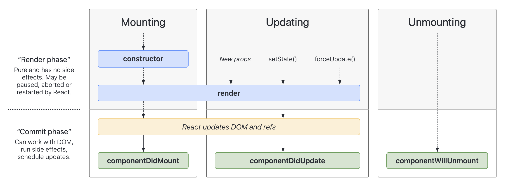
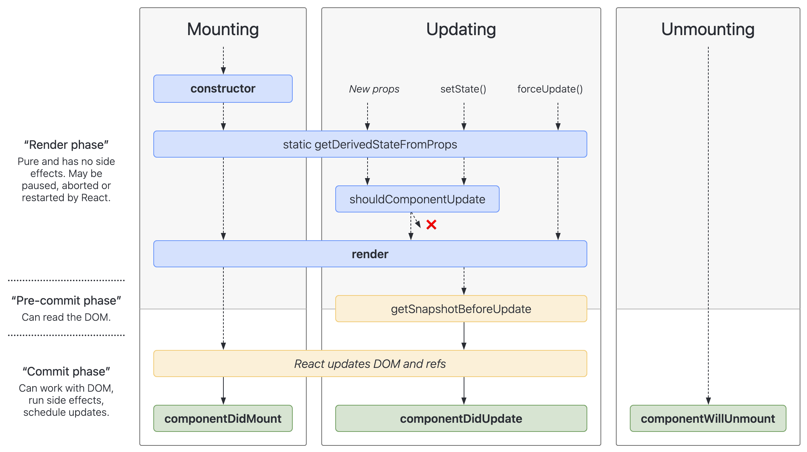

# React

The library for web and native user interfaces. —— 用于构建 Web 和原生交互界面的库。

- [React 官方文档](https://react.dev/)
- [React 官方中文文档](https://react.docschina.org/)

## 一、React 介绍

React 是一个用于构建用户界面（UI）的 JavaScript 库，用户界面由按钮、文本和图像等小单元内容构建而成。React 帮助你把它们组合成可重用、可嵌套的 _组件_。从 web 端网站到移动端应用，屏幕上的所有内容都可以被分解成组件。

### 1.1 React 的特点

**_声明式编程_**

- 声明式编程是目前*整个大前端的开发模式*：Vue、React、Flutter、SwiftUI；
- 它允许我们只需要维护自己的状态，当状态改变时，React 可以根据最新的状态去渲染我们的 UI 界面；

**_组件化开发_**

- 组件化开发页面是目前*前端流行的趋势*，我们会将复杂的界面拆分成*一个个小的组件*；
- 如何合理的进行组件划分和设计也是前端开发的重点；

**_多平台适配_**

- 2013 年，React 发布之初主要是*开发 web 页面*；
- 2015 年，Facebook 推出了 ReactNative，用于开发移动端跨平台；
- 2017 年，Facebook 推出了 ReactVR，用于开发虚拟现实 Web 应用程序；

### 1.2 React 的开发依赖

开发 React 必须依赖三个库：

- react：包含 react 所必须的核心代码；
- react-dom：react 渲染在不同平台所需要的核心代码；
- babel：将 jsx 转换成 React 代码的工具。

对于 Vue 来说，我们只依赖 vue.js 就可以进行开发，但是 React 开发需要依赖三个库，这三个库各司其职，目的是让每一个库单纯做自己的事，**在 React 的 0.14 版本之前是没有 react-dom 这个概念的**，所有的功能都包含在 react 一个库中。

那么 React 后来为什么要拆分 react 这个库呢？原因是 react-native。 react 库中包含 `react web` 和 `react-native` 所共同拥有的核心代码，而 react-dom 中针对 web 和 native 所做的处理不同：

- web 端：`react-dom` 最终会将 jsx 渲染成真实的 DOM，显示在浏览器中；
- native 端：`react-dom` 最终会将 jsx 渲染成原生的控件（比如 Android 中的 Button，IOS 中的 UIButton）。

**那么 react 和 babel 又是什么关系呢？**

babel 是目前前端使用非常广泛的编译器、转译器，可以将 ES6 或更高级特性的语法转换成大多数浏览器都支持的 ES5 的语法。

默认情况下开发 React 其实可以不使用 babel，前提是我们使用 `React.createElement` 来编写源代码，这样编写代码非常繁琐并且可读性很差，我们可以直接编写 jsx（Javascript XML）的语法作为替代，并且让 babel 帮助我们转换成 `React.createElement`。

### 1.3 第一个 React 应用

接下来我们将创建一个 Hello React 的应用。

**html 中引入 React 开发依赖：**

```html
<script
  crossorigin
  src="https://cdn.bootcdn.net/ajax/libs/react/18.2.0/umd/react.development.js"
></script>
<script
  crossorigin
  src="https://cdn.bootcdn.net/ajax/libs/react-dom/18.2.0/umd/react-dom.development.js"
></script>
<script src="https://unpkg.com/@babel/standalone/babel.min.js"></script>
```

引入后需要在含有 `type="text/babel"` 属性的标签中编写 react 代码，这样我们的 babel 才能对 jsx 代码进行转换：

```javascript
<script type="text/babel">
  const root = ReactDOM.createRoot(document.getElementById('root'))
  root.render((
  <h2>Hello React</h2>
  ))
</script>
```

组件化开发实现 Hello React：

```html
<script type="text/babel">
  const root = ReactDOM.createRoot(document.getElementById("root"));

  class App extends React.Component {
    constructor() {
      super();

      this.state = {
        message: "Hello React",
      };
    }

    render() {
      return (
        <div>
          <h2>{this.state.message}</h2>
        </div>
      );
    }
  }

  root.render(<App />);
</script>
```

## 二、JSX 语法

jsx 的书写规范：

- jsx 的顶层只能有一个根元素，所以我们很多时候会在外层包裹一个 div 元素；
- 为了方便阅读，我们通常在 jsx 的外层包裹一个小括号()，这样可以方便阅读，并且小括号内 jsx 可以换行书写；
- jsx 中的标签可以是单标签，也可以是双标签；

### 2.1 jsx 的注释

```jsx
{
  /* 这是JSX的注释 */
}
```

### 2.2 jsx 插入变量

jsx 可以使用{}语法插入变量作为子元素：

```jsx
const message = "hello react";
const title = <h1>{message}</h1>;
```

- 当插入的变量是 Number、String、Array 类型时，可以直接显示；
- 当插入的变量是 null、undefined、Boolean 类型时，不会被渲染出来，如果想要显示，需要蒋它们转换成字符串，常用的转换方法有：toString、拼接空字符串（`+""`）、String(变量)等方式；
- Object 对象类型不能作为子元素（会报 not valid as React child 的错误）。

### 2.3 jsx 嵌入表达式

可以嵌入运算表达式、三元表达式或执行一个函数。

### 2.4 事件绑定

React 事件的命名采用小驼峰式(camelCase)，而不是纯小写，我们需要通过{}传入一个事件处理函数，这个函数会在事件发生时被执行。

事件中 this 绑定的几种方式：

```jsx
class App extends React.Component {
  constructor() {
    super();

    this.state = {
      message: "Hello React",
    };
  }

  btnClick() {
    this.setState({
      message: "Hello React 01",
    });
  }

  btnClick2 = () => {
    this.setState({
      message: "Hello React 02",
    });
  };

  render() {
    return (
      <div>
        <h2>{this.state.message}</h2>
        {/* this绑定方法一：使用 bind 显式绑定*/}
        <button onClick={this.btnClick.bind(this)}>按钮1</button>

        {/* this绑定方法二：ES6 class fields 绑定*/}
        <button onClick={this.btnClick2}>按钮2</button>

        {/* this绑定方法三：使用箭头函数绑定*/}
        <button onClick={() => this.btnClick()}>按钮3</button>
      </div>
    );
  }
}
```

事件绑定中的参数传递：

```jsx
class App extends React.Component {
  constructor() {
    super();
  }

  btnClick(event, name, age) {
    console.log(event, name, age);
  }

  render() {
    return (
      <div>
        {/* 参数传递方式一：使用 bind 传递*/}
        <button onClick={this.btnClick.bind(this, "sun", 18)}>按钮1</button>

        {/* this绑定方法二：使用箭头函数绑定*/}
        <button onClick={(e) => this.btnClick(e, "sun2", 24)}>按钮2</button>
      </div>
    );
  }
}
```

请注意：在上述示例方式一中，通过 bind 传递参数，由于 event 参数是在函数调用时传入，所以 btnClick 在调用时传入的参数顺序实际上是 btnClick("sun", 18, event)。

### 2.5 jsx 的本质

实际上，jsx 仅仅只是 `React.createElement(component, props,...children) `函数的语法糖。所有的 jsx 最终都会被转换成 React.createElement 的函数进行调用。

createElement 需要传递三个参数：

参数一：type

- 代表当前 ReactElement 的类型；
- 如果是标签元素，那么就使用字符串表示"div"；
- 如果是组件元素，那么就直接使用组件的名称。

参数二：config

- 所有 jsx 中的属性都在 config 中以对象的属性和值的形式存储；
- 比如传入 className 作为元素的 class。

参数三：children

- 存放在标签中的内容，以 children 数组的方式进行存储；
- 当然，如果是多个元素呢？React 内部有对它们进行处理，处理的源码在下方。

jsx -> ReactElement（虚拟 DOM） -> 真实 DOM

## 三、React 脚手架

### 3.1 PWA

PWA 全称 Progressive Web App，即渐进式 WEB 应用。一个 PWA 应用首先应该是一个通过 Web 技术编写出的网页，随后添加上 App Mainfest 和 Service Worker 来实现 PWA 的安装和离线等功能，这种 Web 存在的形式，我们也称之为 Web App。

PWA 解决了哪些问题呢？

- 使我们的 Web app 可以*添加至主屏幕*，点击主屏幕图标可以实现启动动画以及隐藏地址栏；
- 可以实现*离线缓存功能*，即使手机没有网络，依然可以使用一些离线功能；
- 实现了*消息推送*；
- 还有等等一些类似于 Native App 相关的功能；

## 四、React 组件化开发

### 4.1 React 的组件化

React 的组件相对于 Vue 更加的灵活和多样，按照不同的方式可以分成很多类的组件：

- 根据组件的定义方式，可以分为：函数组件（Functional Component）和类组件（Class Component）；
- 根据组件内部是否有状态需要维护，可以分成：*无状态组件（Stateless Component）*和*有状态组件（Stateful Component）*；
- 根据组件的不同职责，可以分成：*展示型组件（Presentational Component）*和*容器型组件（Container Component）*。

#### 4.1.1 类组件

类组件的定义有如下要求：

- 组件的名称是大写字符开头（无论是类组件还是函数组件）；
- 类组件需要继承自 React.Component；
- 类组件必须实现 render 函数。

使用 class 定义一个组件：

- `constructor` 是可选的，我们通常在 constructor 中初始化一些数据；
- `this.state` 中维护的就是我们组件内部的数据；
- `render() `方法是 class 组件中**唯一必须实现的方法**；

#### 4.1.2 Render 函数的返回值

当 render 函数被调用时，它会检查 this.props 和 this.state 的变化并返回以下类型之一：

- React 元素：通常通过 jsx 创建；
- 数组或 fragment：使 render 方法可以返回多个元素；
- Portals：可以渲染子节点到不同的 DOM 子树中；
- 字符串或数值类型：在 DOM 中会被渲染成文本节点；
- 布尔类型或 null：什么都不渲染。

#### 4.1.3 函数式组件

函数式组件是**使用 function 来进行定义的函数**，只是这个函数会返回和类组件中 render 函数返回内容一样的内容。

函数式组件有自己的特点（后面结合 hooks 功能会更加强大）：

- 没有生命周期：会被更新并挂载，但是没有生命周期函数；
- this 关键字不能指向组件实例（因为没有组件实例）；
- 没有内部状态（state）。

### 4.2 组件的生命周期

React 内部为了告诉我们当前处于哪些阶段，会对我们组件内部实现的**某些函数进行回调**，这些函数就是**生命周期函数**：

- `componentDidMount` 函数：组件已经挂载到 DOM 上时，就会回调；
- `componentDidUpdate` 函数：组件已经发生了更新时，就会回调；
- `componentWillUnmount` 函数：组件即将被移除时，就会回调；

我们谈 React 生命周期时，主要谈的是类的生命周期，因为函数式组件是没有生命周期函数的（后面我们可以通过 hooks 来模拟一些生命周期的回调。

#### 4.2.1 生命周期函数

**Constructor**

如果不初始化 state 或不进行方法绑定，则不需要为 React 组件实现构造函数。constructor 中通常只做两件事情：

- 通过给 this.state 赋值对象来初始化内部的 state；
- 为事件绑定实例（this）。

**componentDidMount**

- componentDidMount() 会在组件挂载后（插入 DOM 树中）立即调用；
- componentDidMount 中通常进行什么操作呢？依赖于 DOM 的操作可以在这里进行；网络请求最好在这里进行；可以在这里添加一些订阅（会在 componentWillUnmount 取消订阅）。

**componentDidUpdate**

componentDidUpdate() 会在更新后立即被调用，首次渲染不会执行此方法。

- 当组件更新后，可以在此处对 DOM 进行操作；
- 如果你对更新前后的 props 进行了比较，也可以选择在此处进行网络请求；（例如：当 props 未发生变化时，则不会执行网络请求）。

**componentWillUnmount**

componentWillUnmount() 会在组件卸载及销毁之前直接调用。

- 在此方法中执行必要的清理操作；
- 例如清除 timer、取消网络请求或清除在 componentDidMount() 中创建的订阅等。

<!--  -->



#### 4.2.2 不常用的生命周期函数

- **getDerivedStateFromProps**：state 的值在任何时候都依赖于 props 时使用，该方法返回一个对象来更新 state；
- **getSnapshotBeforeUpdate**：在 React 更新 DOM 之前回调的一个函数，可以获取 DOM 更新前的一些信息（比如说滚动位置）；
- **shouldComponentUpdate**：该生命周期函数很常用，但是我们等待讲性能优化时再进行讲解。



### 4.3 组件间的通信

父组件在展示子组件时，可能会传递一些数据给子组件，父组件通过`属性=值`的形式给子组件传递数据，子组件通过 props 参数来获取父组件传递过来的数据。

#### 4.3.1 参数 propTypes

我们有时候可能希望验证传递给子组件的数据，特别是对于大型项目来说：

- 当然，如果你的项目默认继承了 Flow 或者 TypeScript，那么直接就可以进行类型验证；
- 但是，即使我们没有使用 Flow 或者 Typescript，也可以通过 prop-types 库来进行参数验证。

从 react v15.5 开始，React.PropTypes 已移入另一个包中：prop-types 库。

#### 4.3.2 子组件传递给父组件

在某些情况下，我们需要子组件向父组件传递消息，在 vue 中是通过自定义事件来实现的，在 react 中是通过 props 传递消息，只是让父组件给子组件传递一个回调函数，子组件中调用这个函数即可。

### 4.4 组件插槽用法

### 4.5 非父子的通信

### 4.6 setState 使用详解
